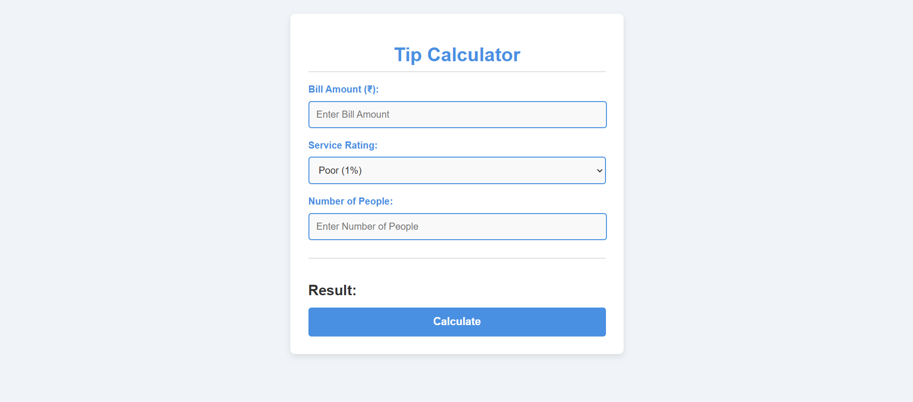

# Tip Calculator

This is a **Tip Calculator** application that helps users calculate tips and split the total meal cost among a specified number of people. It allows users to input the total bill amount, select a service rating, and view the tip percentage applied. The calculator then calculates the tip, total amount, and amount per person in an elegant and user-friendly interface.

## Preview

Here’s a preview of the application’s interface:

## Features

- **Bill Amount Input**: Enter the total cost of the meal.
- **Service Rating**: Choose from multiple service rating options (Poor, Average, Good, Excellent).
- **Tip Calculation**: Automatically calculates the tip based on the service rating and meal price.
- **Total Amount Per Person**: Displays the final total amount split among the specified number of people.
- **Responsive Design**: Optimized for desktop and mobile use.

## How It Works

1. **Enter the Bill Amount**: Input the total cost of the meal.
2. **Select the Service Rating**: Choose how you rate the service (Poor, Average, Good, Excellent), which will affect the tip.
3. **Specify the Number of People**: Enter how many people will split the bill.
4. The app will **automatically calculate**:
   - The **tip amount** based on the service rating.
   - The **total amount** including the tip.
   - The **amount per person** based on the total amount and number of people.

## Interface

The interface is designed to be clean, modern, and user-friendly, providing an intuitive experience for anyone who needs to calculate a tip or split a bill.

- **Inputs** are clearly labeled and easy to fill out.
- **Responsive Design** ensures that the application looks good on both desktop and mobile screens.

## Future Enhancements

Here are a few ideas for enhancing this application in the future:

- **Multi-Currency Support**: Allow users to calculate tips in different currencies, with exchange rates updated in real-time.
- **Custom Tip Percentages**: Let users input their own tip percentage instead of selecting from predefined options.
- **Dark/Light Mode**: Add the option to switch between dark and light themes for a more customizable experience.
- **Expense Breakdown**: Provide a breakdown of the meal's cost, including tip, tax, and other possible charges.
- **Save Bill History**: Allow users to save their bill calculations for future reference.
- **Localization**: Support multiple languages and regional formats (e.g., currency, decimal points).

## Contributing

We welcome contributions from the community! If you have ideas for improvements or bug fixes, feel free to open an issue or submit a pull request. Here are some ways you can contribute:

1. **Bug Fixes**: If you find any bugs, please open an issue and submit a pull request with your fix.
2. **Feature Requests**: If you have an idea for a feature that would improve the app, let us know by opening an issue.
3. **Documentation**: Help improve the documentation or add more detailed instructions.

To contribute:

1. Fork this repository.
2. Clone your fork to your local machine.
3. Create a new branch for your changes.
4. Commit your changes and push them to your fork.
5. Open a pull request with a description of what you’ve done.

---

Pay with a tip… and maybe a smile! 😄💰
